<h1 align="center">Hey There! I'm Omar</h1>

I'm a backend developer. I'm currently studying Computer Engineering while taking on complex ideas to the next level by
building scalable servers and custom solutions using Java and [many more](#technologies).

I also build [open source](https://github.com/omardiaadev?tab=repositories&sort=stargazers) projects for fun.

<h2>Let's Chat!</h2>

**If you need help or want to discuss an idea, don't hesitate to reach out!**

<h2>Technologies</h2>

    
    
    
    
    

    
<b>More Technologies</b>

     
    

        
        
        
        
    

    

        
        
        
        
        
        
    

    

        
        
        
        
        
        
        
    

    

        
        
        
        
        
        
        
        
        
    

    
<b>Open Source Activity</b>

     
    
    

    

